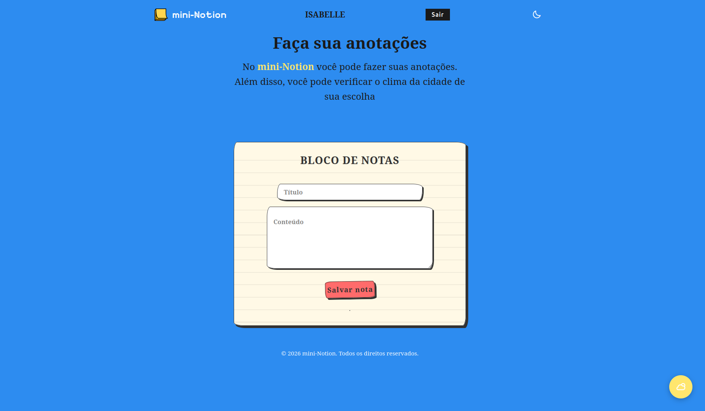

# Simulador Sistema de Anotação

## Descrição

Sistema web simples para criar, visualizar, editar e excluir anotações (CRUD), com interface visual própria e um widget de clima consumindo uma API externa gratuita.
* **Objetivo do projeto:** aprender, na prática, os fundamentos de backend, banco de dados, frontend e consumo de API, trabalhando em equipe com Git.

## Ferramentas e Tecnologias

## Deployment

### Render

Este projeto está configurado para [Render](https://vercel.com).

## Contribuidores

